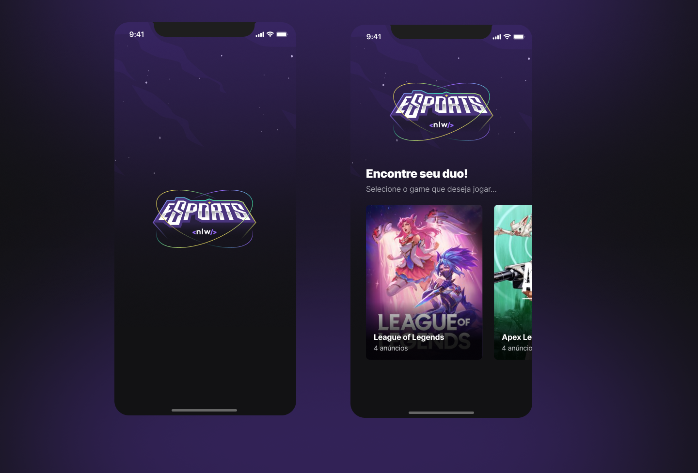

<div>
  <h1 align="center"> 
    
  </h1>
  <h2 align="center"> 
    NLW - Rocketseat
  </h2>
  <h3 align="center"> 
    Projeto desenvolvido durante a NLW eSports da Rocketseat na trilha Ignite
  </h3>

  <p align="center">
    <a href="https://rocketseat.com.br">
      
    </a>
    <a href="https://github.com/jorgeeder"> 
      
    </a>
    
    
    <a href="https://opensource.org/licenses/MIT">
      
    </a>
  </p>
</div>

## About The Project

This application is intended to connect players where users can find the perfect match from a partner at a previously informed date and time to play their favorite games.

## Features

- Web application
    - lists the games registered on the server and the amount of ads in each game
    - allows you to register an ad to find a player
- Mobile
  - lists the games registered on the server and the amount of ads in each game
  - list ads in each game
  - connect players button shows the discord of the player who created the ad and allows copying to the clipboard
- Server
  - registered games
  - route to register a player ad
  - route to list registered ads
  - route to list registered games
  - route to list a player's Discord

## Technologies

-   **[React](https://reactjs.org/)**
      - [Tailwind CSS](https://tailwindcss.com/)
      - [Vite](https://vitejs.dev/)
      - [Radix UI](https://www.radix-ui.com/)
      - [Axios](https://axios-http.com/)
      - [Phosphor Icons](https://phosphoricons.com/)

-   **[React Native](https://reactnative.dev/)**
      - [Expo](https://expo.dev/)
      - [React Navigation](https://reactnavigation.org/)
      - [Phosphor Icons](https://phosphoricons.com/)

-   **[NodeJS](https://nodejs.org/en/)**
     - [SQlite](https://www.sqlite.org/index.html)
     - [Prisma](https://www.prisma.io/)
     - [Cors](https://expressjs.com/en/resources/middleware/cors.html)
     - [Express](https://expressjs.com/)

## Layout
Application layout in **[Figma](https://www.figma.com/file/8RgcHqrjhGvShhVQqt9F5k/NLW-eSports-(Community)?node-id=0%3A1)**

### Web


### Mobile




## Requirement

-   **[Node.js](https://nodejs.org/)**
-   **[React Native Environment Setup](https://nodejs.org/)**


## Running The Project

```
# You can use npm or yarn to manage packages

## Clone the repository
git clone https://github.com/jorgeeder/nlw-esports-ignite

## Access the project folder in the terminal
cd nlw-esports-ignite

## Go to server folder
cd server

## To install dependencies in server
npm install 

## Prisma Migrate generates a history of .sql migration files, and plays a 
## role in both development and deployment.
npx prisma migrate dev

## Run the Server
npm run dev

## GUI to view and edit data in your database
npx prisma studio

## Return to project root
cd ..

## Go to web folder
cd web

## To install dependencies in web
npm install 

## Run the Web application
npm run dev

## Return to project root
cd ..

## Go to mobile folder
cd mobile

## Run the Mobile application
expo start

## Scan the qr code with your device or use the emulator


```
## License

This project is under the MIT license. See the [LICENSE](/LICENSE) file for more details.


<div align="center">
  <p> Made with 💜 by <a href="https://github.com/jorgeeder">Jorge Eder</a> </p>
  <p>
    <a href="https://www.linkedin.com/in/jorgeeder/">
      
    </a>
    <a href = "mailto:jorgeeder.dev@gmail.com">
      
    </a>
  </p>
</div>