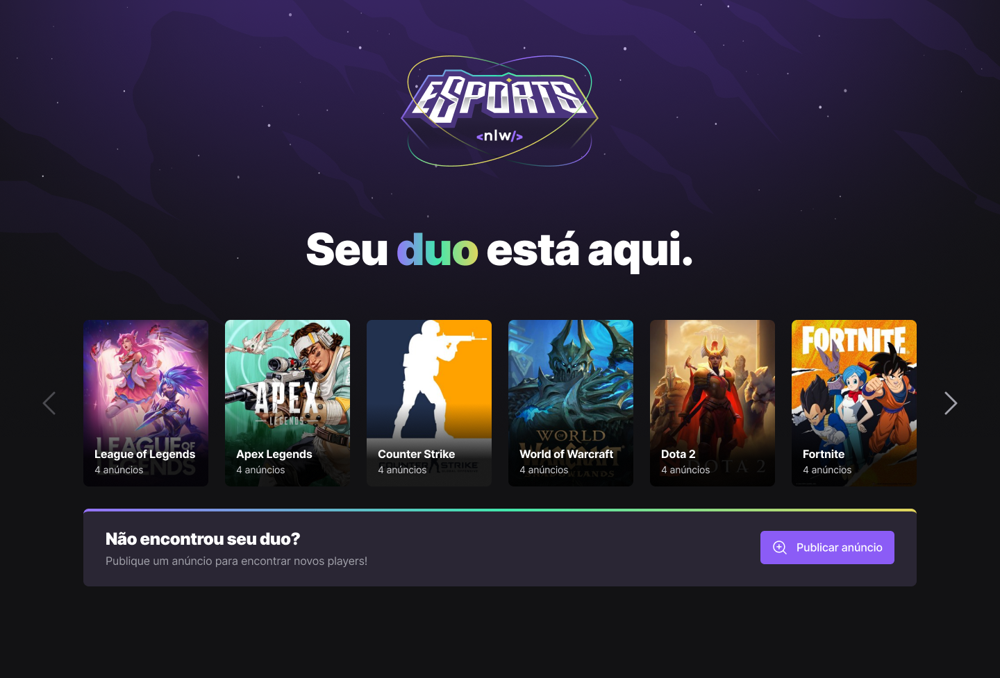
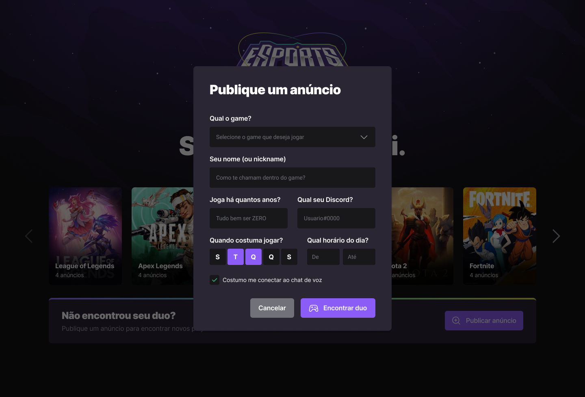
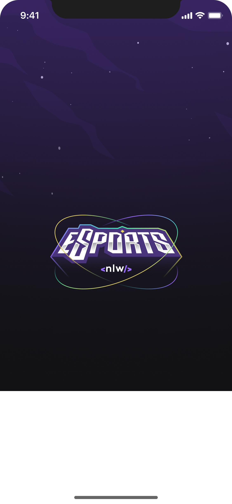
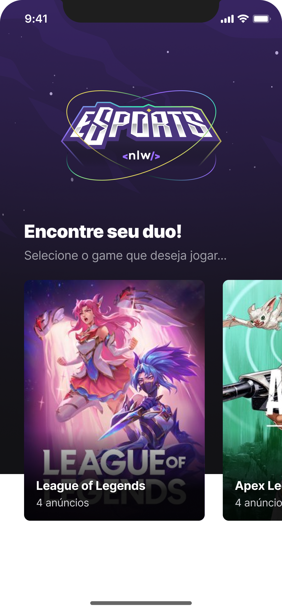
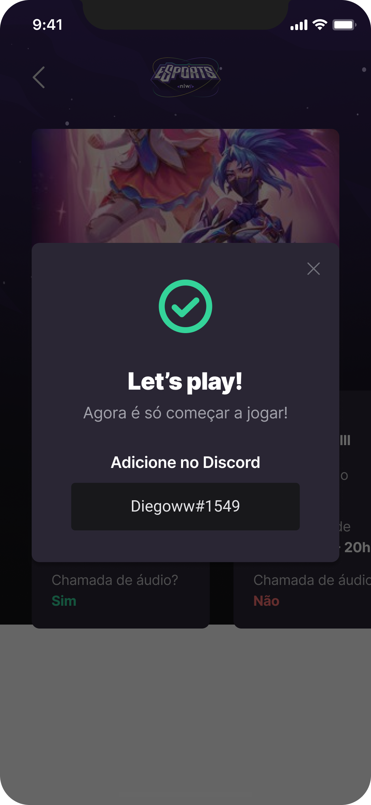
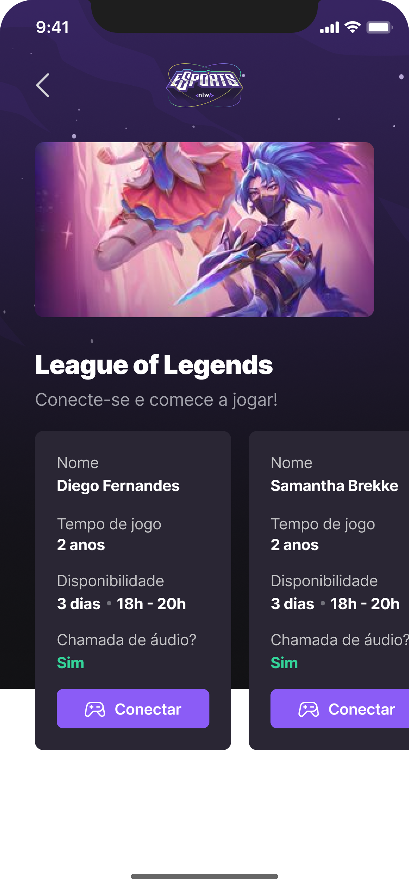

<div>
  <h1 align="center"> 
    
  </h1>
  <h2 align="center"> 
    NLW - Rocketseat
  </h2>
  <h3 align="center"> 
    Projeto desenvolvido durante a NLW eSports da Rocketseat na trilha Ignite
  </h3>

  <p align="center">
    <a href="https://rocketseat.com.br">
      
    </a>
    <a href="https://github.com/jorgeeder"> 
      
    </a>
    
    
    <a href="https://opensource.org/licenses/MIT">
      
    </a>
  </p>
</div>

## About The Project

Esta aplicação tem o intuito de conectar jogadores onde os usuários poderam encontrar a combiação perfeita de um parceiro em uma data e horário previamente informados para jogar os seus jogos favoritos.

Será utilizando a API da Twitch para listar os jogos em alta para que os usuários possam escolher seus jogos favoritos.

## Features

🚧 under construction... 🚧

## Technologies

-   **[React](https://reactjs.org/)**
-   **[React Native](https://reactnative.dev/)**
-   **[NodeJS](https://nodejs.org/en/)**

## Application in Use
Application layout in **[Figma](https://www.figma.com/file/8RgcHqrjhGvShhVQqt9F5k/NLW-eSports-(Community)?node-id=0%3A1)**

### Web




### Mobile






## Requirement

-   **[Node.js](https://nodejs.org/)**
-   **[React Native Environment Setup](https://nodejs.org/)**


## Running The Project

```

🚧 under construction... 🚧

```
## License

This project is under the MIT license. See the [LICENSE](/LICENSE) file for more details.


<div align="center">
  <p> Made with 💜 by <a href="https://github.com/jorgeeder">Jorge Eder</a> </p>
  <p>
    <a href="https://www.linkedin.com/in/jorgeeder/">
      
    </a>
    <a href = "mailto:jorgeeder.dev@gmail.com">
      
    </a>
  </p>
</div>